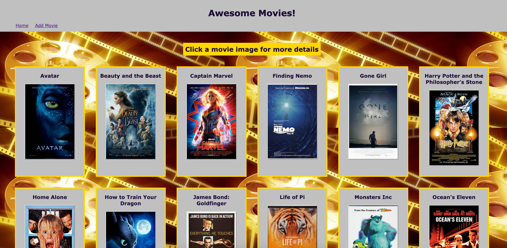
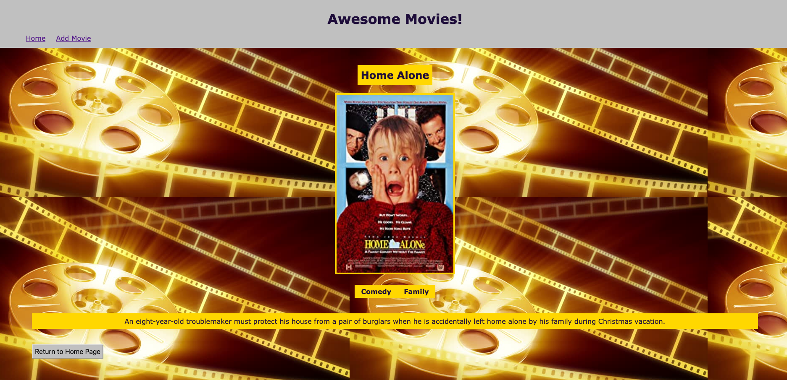
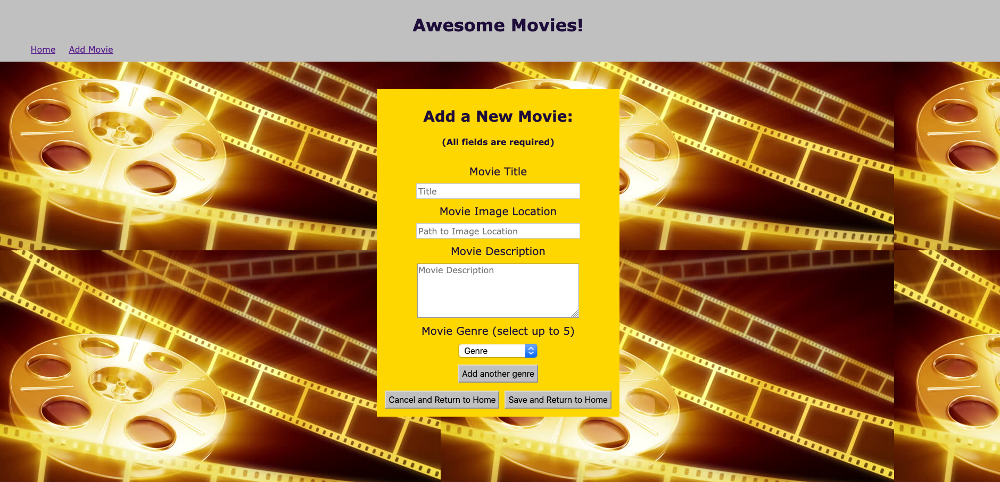

# Movie App

## Description

Duration: 72 hours - evening 11/5/2020 - evening 11/8/2020

This project is an app that contains movies and uses saga functions to display them, handling the request to the server from the client.  The app contains a home page, which lists all movies currently in the database.  It also has a detais page that will be shown when a movie image is clicked on.  Lastly, there is a page to add a new movie, including the title, a url location for an image, a description, and up to five genres that apply to the movie.

The project had a fair number of challenges, including forcing images inside a button, and handling up to five genres added by the user.  The button took some work, and a lot of troubleshooting.  The ability to take in multiple genres did not seem hard to tackle in my head, and I tried many things, both to make the client side code work, as well as the post route code work in the router, and I got errors from many of the things that I thought would work, so in the end, I decided the best thing was going to be to make it work with really long, and ugly code that functions properly.  Also, it was tough to get started, as I thought junction tables would be difficult to implement and understand, and I realized that they were not bad, and made a lot of sense.

## Screen Shots

Home Page

Details Page

Add Movie Page

### Prerequisites

- The project requires Node.  It may be downloaded here: https://nodejs.org/en/

- The project requires the creation of a database.  Postgresql was used for this project.  Postgresql may be found here: https://www.postgresql.org/  Postico also may be used to visually see the database.  It is found here: https://eggerapps.at/postico/.  The database is titled 'saga_movies_weekend'.  The entire database.sql file may be copied into Postice and executed to create the initial tables and insert data for 14 movies into them.  

- The project requires an understanding of HTML, CSS, JavaScript, React with Redux and sagas, http requests to a server, queries to a database, and an understanding of pool.

## Installation

This project can be forked and cloned from the Github repository.  It has many dependencies that can be installed using the command 'npm install'.  

A Postgresql database is required.  It needs to be called 'saga_movies_weekend', and the tables can be created by copying the contents of the database.sql file into Postico and executing.

In the terminal, enter the command 'npm run server'.  Open a new terminal window, and enter the command 'npm run client'.  This should open the browser at the initial page, which displays all of the movies in the databae.

## Usage 

1.  On pageload, the app is brought to the home page, which displays all movies in the database, displaying only their title, and poster image. 

2.  At this point, a user can click on any of the poster images to go to a details page for that movie that includes the title, the poster image, the genres for the movie, and a description of the movie.  Here, there is a back to home button to return to the home page listing all movies.

3.  There is also an add movie page.  This page has text inputs for movie title, address to a location with a movie image, and movie description.  There is a drop down box here with all the available genres to select from.  There are buttons below these inputs.  The first brings up anoter drop down box to add another genre.  If there are multiple genre boxes, a button appears for if one is desired to be removed.  There is a button to cancel the movie submission and return to the home page.  Finally, there is a save button to submit the info entered to the database and return to the home page.  To save, all the text fields must be filled in, and if there are multiple drop down boxes opened, they may not be the same value.

4.  There is a home and add movie link at the top of all of the pages to move quickly between pages.

## Built With

- Redux-Sage
- React
- CSS
- Node
- Express
- JavaScript
- HTML
- Postgresql
- Pool
- Axios